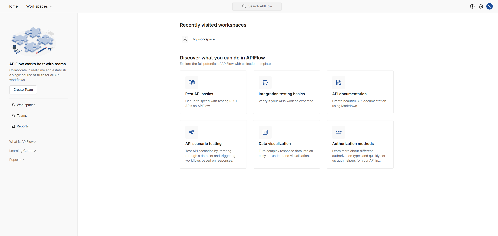

# API Management & Collaboration Platform
A robust platform for managing and collaborating on APIs across workspaces, collections, and folders. Inspired by Postman, this platform enhances API workflows with features like environment testing, documentation viewing, persona-based authentication simulations, and background collection processing via RabbitMQ.

## Screenshots
<p align="center">
  
  <br/>
  <em>Home page</em>
</p>

<p align="center">
  
  <br/>
  <em>API Collection Documentation page</em>
</p>

<p align="center">
  
  <br/>
  <em>API Request detail page with environment variables suggestion</em>
</p>

<p align="center">
  
  <br/>
  <em>API Request detail page showing a post-response script result</em>
</p>

## Features
### Workspace & collection management
- Organize API Requests by workspace, collection, and folder
- Import/export collections for easy sharing and backup
- Easily collaborate at the workspace level

### API request handling
- Fine-grained editing of requests, including method, URL, parameters, headers, authorization, and body
- Pre-request & post-response scripting at all levels (collections, folders, requests)

### Environments
- Create, edit, view, delete, and duplicate environments
- Easily switch between environments to test different configurations

### Persona simulation
- Create, edit, view, delete, and duplicate personas
- Simulate API requests using different roles
- Authenticate as a persona to test permission-based access flows

### API collection documentation
- Interact with your API documentation using a chat-based interface
- Centralized documentation for all requests within a collection


## Quick start
Follow the steps below to set up the platform locally:
### 1. Clone the repository
```bash
git clone https://github.com/manhhung2111/APIFlow.git
cd APIFlow
```
### 2. Install dependencies
Make sure you have <b>Node.js</b>, <b>npm</b>, <b>Docker Desktop</b> installed.
#### Terminal 1 – Install backend dependencies
```bash
cd backend
npm install
```
#### Terminal 2 – Install frontend dependencies
```bash
cd frontend
npm install
```
#### Terminal 3 - Start Docker services
```bash
docker compose up -d
```

#### Set up environment variables
Create `.env` files in both the backend and frontend directories, and configure the necessary variables as specified in `./backend/.env.example` and `./frontend/.env.development`.

### 3. Run the deployment server
#### Terminal 1 – Run backend server
```bash
cd backend
npm run dev
```
#### Terminal 2 – Run frontend server
```bash
cd frontend
npm run dev
```

